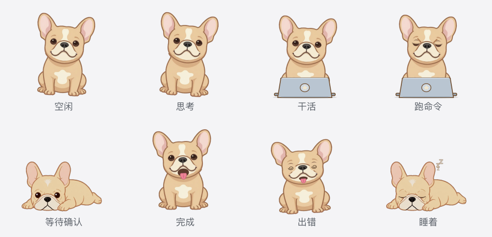

<div align="center">

[← 中文](README.md) · **English**

# DSH Bulldog Desktop Pet 🐕

**A desktop companion that changes pose with real DeepSeek Harness session state.**

[Update and rollback](docs/UPDATING.md) · [Skin pipeline](skin/README.md)

</div>



DSH enables it and owns its lifecycle. On the desktop it is a transparent, frameless,
always-on-top French bulldog whose animation comes from DSH session events — it never looks
at the screen, so typing in another app does not make it move.

## Install

macOS (the native Swift window, which this repository develops on):

```bash
git clone git@github.com:leonty1/dsh-desktop-pet-bulldog.git
cd dsh-desktop-pet-bulldog
npm install          # prepare bakes the 1240 sprite frames (~30s), then builds the Helper (~13s)
dsh plugin --profile web add .
```

Neither `assets/pet/` (the frames) nor `runtime/bin/` (the Helper) is in git: both are build
output. The repository tracks 75 files and about 1.2 MB, and the frames come back from the three
716 KB masters in `skin/poses/` — `scripts/ensure-assets.mjs` checks every path the manifest
names, rebakes when one is missing, and skips with one line when the set is complete.

Windows and Linux use the PySide6 Helper, which install does not build for you — that would
want Python, PyInstaller and PySide6, and minutes of fetching and freezing do not belong in
an install step. Run it once yourself:

```bash
npm install
npm run build:helper
dsh plugin --profile web add .
```

DSH can also install straight from the repository — it is public, so `git+https://`, the
`github:` shorthand, and SSH all work:

```bash
dsh plugin --profile web add git+https://github.com/leonty1/dsh-desktop-pet-bulldog.git
```

pnpm blocks dependencies that carry build scripts, so the first attempt always stops. Copy the
key it prints, verbatim, into the profile's `pnpm-workspace.yaml` and run again — the key's form
follows the spec: a `git+ssh://…` spec yields `dsh-frenchie@git+ssh://…#<commit>`, a
`git+https://…` spec yields the resolved
`dsh-frenchie@https://codeload.github.com/…/tar.gz/<commit>`, and pnpm 10 instead wants the
package name in `onlyBuiltDependencies`. One full install from the repository — download, bake,
build — measured about two minutes.

pnpm also blocks dependencies that carry build scripts the first time. Add what it prints to the
profile's `pnpm-workspace.yaml` and run again: pnpm 11 wants an `allowBuilds` map keyed by the
`dsh-frenchie@<spec>#<commit>` string it names, while pnpm 10 wants the package name in an
`onlyBuiltDependencies` list.

The desktop (Electron) profile belongs to the application: `dsh plugin --profile desktop …` is
refused outright, so install and uninstall happen on the app's Plugins page. Upgrade and
rollback are in [docs/UPDATING.md](docs/UPDATING.md). After installing, start DSH as usual;
there is no Helper to launch by hand.

## States and clips

Each DSH session state maps to a clip (`stateMap` in `assets/pet-manifest.json`):

| DSH state | Clip | What it looks like |
| --- | --- | --- |
| `IDLE` | `idle` | Sitting, breathing slowly, glancing aside now and then |
| `THINKING` | `thinking` | Head lifts to think, ears moving with it |
| `WORKING` | `working` / `working_command` | See below |
| `WAITING` | `waiting` | Lying down with its chin on its paws, blinking slowly |
| `SUCCESS` | `success` | Two barks with its tongue out |
| `ERROR` | `error` | Crouched and whining, eyes swimming |
| `DISCONNECTED` | `idle` | Back to rest |

`WORKING` splits again by tool: searching, reading and editing are paws on a keyboard
(`working`); running a command or a test is a frown aimed at the screen while output comes
back (`working_command`).

While idle it plays a small action every so often — a glance, a raised paw, a tail wag, a lap
of its own nose — at the rate the activity-level setting asks for.

Settling down happens in two steps. After the lie-down interval (default 1 minute) it lies
down with its eyes open; only after the sleep interval (default 6 minutes) does it close them
and float a Z. Both count from the last sign of life, either set to 0 skips that step, and a
new state while it lies gets it up before the work starts. Lying down and getting up are real
transitions (`lie_down`, `wake_up`), not a cut between drawings.

## Desktop interactions

- **Drag:** hold the body to move it; the position is saved. Blank space around the dog and
  the bubble above its head are not handles. Releasing plays brief release, dizzy, and protest
  reactions, each held for that clip's own length; reduced motion skips them.
- **Click:** the spot decides — the head is a pat, a front paw is lifted when you click it, the
  right side wags the tail, anywhere else is a poke; a double-click is always a pat. It then
  returns to the latest DSH state.
- **Hover:** touching the dog gets it up; on macOS it also follows the cursor with its gaze
  while idle (the Qt port stops at getting up).
- **Right-click:** size, bubble size, reduced motion, open WebUI, hide for now, or close for
  this run.

## Status card

A single task is two lines: the state title and the step in hand (project, phase, todo
progress, the reasoning effort actually applied).

Several tasks at once list as a table, which folds into a small chip six seconds after it
opens — naming only the task that started first, with `+N` for the rest. Hovering the bubble
unfolds the whole list, and it folds back two seconds after the pointer leaves. A task joining
or finishing unfolds it too; a progress update on a task already listed does not.

## Settings

DSH settings → plugins → plugin configuration → desktop bulldog. DSH persists them, so a
normal plugin update needs no reconfiguration.

| Setting | Default | Notes |
| --- | --- | --- |
| Enabled | on | Off keeps the Helper down entirely |
| Character size | 0.6 | 0.5–1.4 |
| Bubble size | 1 | 0.8–1.2 |
| Activity level | normal | Quiet / normal / lively rate of idle micro-actions |
| Reduced motion | off | No micro-actions or release reactions; looping frames rest on the still one |
| Lie down after | 1 min | Minutes of quiet before it lies down; 0 disables |
| Sleep after | 6 min | Minutes of quiet before it falls asleep; 0 disables |
| Notification sound | on | One sound on success or error |
| Bubble visibility | always | Always / hidden / custom list of states (default SUCCESS, ERROR, WAITING) |
| Subagents | off | When on, subagent sessions can take the card |
| In-page pet | off | A lightweight pet in the corner of the DSH page, usable alongside the window |

## Repository layout

```text
src/           the DSH plugin: session-event reduction, state priority, the newline JSON protocol
native/macos/  the native transparent always-on-top window (Swift/AppKit)
runtime/       the PySide6 Helper for Windows/Linux, and the animation state machine both share
assets/        25 sprite clips and pet-manifest.json
skin/          the rig pipeline that bakes those frames: masters, cuts, per-frame matrices, SVG
docs/          update and rollback, release notes, acceptance records
runtime/bin/   build output, not in git
```

## Where the skin comes from

One master image is cut into layered bones — torso, head, two ears, one front paw — each with
a parent and a pivot, and every clip is a pose over that hierarchy, baked at 2× resolution
(logical 412×344, device 824×688). All states share one body, so a clip switch can't jump
between two differently drawn dogs. Details in [skin/README.md](skin/README.md).

```bash
npm run skin                         # rebake all 25 clips
node skin/build-sprites.mjs --rest   # each rig at rest, diffed against its master
node skin/outline-scan.mjs           # rim pixels with no outline
```

Baking writes to `skin/frames/`; review it, then sync the result into `assets/`.

## Development and tests

```bash
npm install
npm test             # drive the built Helper over the protocol and grab a snapshot
npm run test:swift   # state machine and layout store unit tests, needs Xcode
```

`test:swift` cannot run on a machine with only Command Line Tools: CLT ships no XCTest, so
`swift test` fails at `no such module 'XCTest'`. The Qt and Swift ports are two parallel
implementations, so an animation rule changes in both `runtime/animation_model.py` and
`native/macos/Sources/AnimationModel.swift`; their agreement is checked by driving both from
one manifest.

## Boundaries

- It reacts only to DSH agent events: no screenshots, no reading other applications, no
  mistaking your activity elsewhere for DSH work.
- When DSH provides no todo list it shows only reliable information such as the phase, and
  never invents a completion percentage.
- The macOS `.app` carries an ad-hoc signature; there is no Developer ID signature or
  notarization.
- Settings and desktop status copy are Simplified Chinese only.

## License and origin

The code is MIT ([`LICENSE`](./LICENSE)). This repository is a fork of the community plugin
[dsh-dafeiyu](https://github.com/QCYTSN/dsh-dafeiyu): the protocol, the state machine's
skeleton and the Helper carry over, while the bulldog's appearance (`assets/pet/`, `skin/`)
and the native macOS window are rebuilt here. Asset provenance is in
[`ASSET_LICENSE.md`](./ASSET_LICENSE.md).
